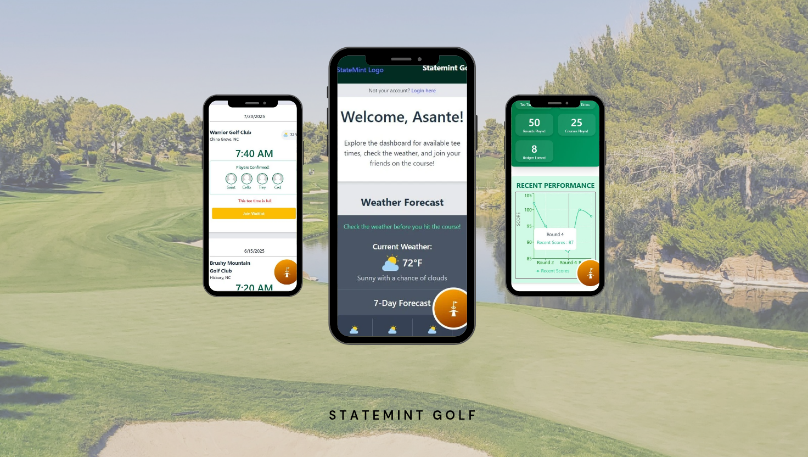

# Statemint Golf App
Welcome to the Statemint Golf App! This application is designed to enhance your golfing experience by providing a platform to track your golf scores, analyze your performance, and connect with fellow golf enthusiasts.

   

## Table of Contents
- [Screenshots](#screenshots)
- [Features](#features)
- [Technologies Used](#technologies-used)
- [Links](#links)
- [Installation](#installation)
- [Getting Started](#getting-started)
- [Contributing](#contributing)
- [Contact](#contact)

## Screenshots
Below is a screenshot of the project:

## Features
- **User Authentication**: Secure login and registration system.
- **Score Tracking**: Easily log your golf scores and view your performance over time.
- **Performance Analytics**: Visualize your game statistics with interactive charts.   
- **Community Engagement**: Connect with other golfers, share tips, and discuss strategies.
- **Responsive Design**: Optimized for both desktop and mobile devices.

## Technologies Used
- **Frontend**: React, Redux, Tailwind CSS
- **Backend**: Node.js, Express
- **Database**: MongoDB
- **Authentication**: JWT (JSON Web Tokens)
- **Deployment**: Heroku for backend, Netlify for frontend
- **Testing**: Jest, React Testing Library
- **Version Control**: Git, GitHub

## Links
[Git Repo](https://github.com/asantercureton/statemint-golf-app)

<!-- [Live Link - GitHub Pages](https://asantercureton.github.io/statemint-golf-app/) -->

## Installation
Users can click the link above to view the live version of the web app on mobile and enjoy the experience!

## Getting-Started
- Create an account or log in.
- Once logged in, you can create new tee times, log your scores, and view your performance analytics.
- The app is designed to be responsive and works well on both desktop and mobile devices.

## Contributing
We welcome contributions to the Statemint Golf App! If you have suggestions for improvements or new features, please feel free to open an issue or submit a pull request.

## Contact
For any questions or feedback, please reach out to us at [asantercureton@gmail.com](mailto:asantercureton@gmail.com).

---
© 2025 CCure Coaching, Arts & Apparel.

